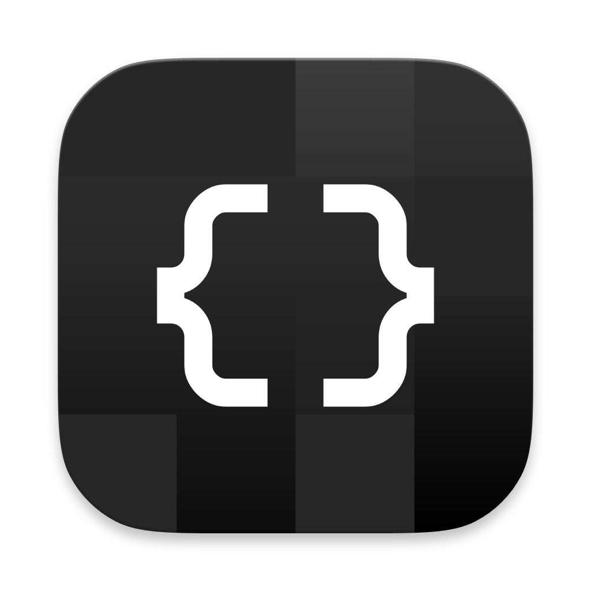
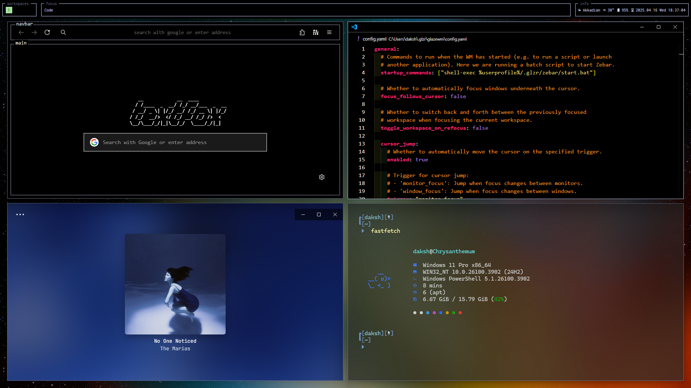
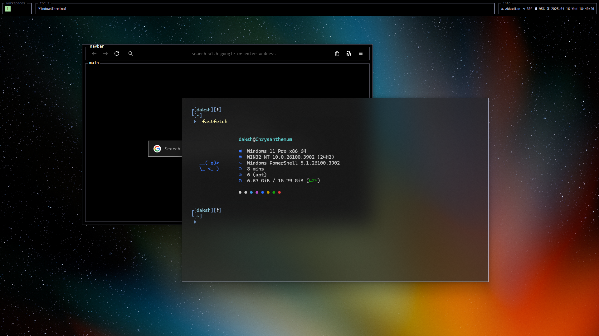

<div align="center">
  
  <h1>MonoTUI</h1>
</div>

<div align="center">
  
  
</div>

<br>

<div align="center">
  My collection of themes and apps for a TUI system theme. Everything was made possible because of community efforts. I cannot express how much I love the community for all these projects and I appreciate them for all the hard work they have done.
</div>

<br>

<div align="center">
  
  
  
</div>

----------

### Very incomplete

to do:
- add config files for everything
- add screenshots
- add setup and how-to for windhawk
- add credits for everything

----------

### GlazeWM
(Add screenshot)

[Get it from here!](https://github.com/glzr-io/glazewm)

1. Once GlazeWM is installed and running, right-click on the tray icon and click on "Show config folder"
2. Replace the `config.yaml` file with the one in the repo.

This file contains a few changes (such as different window gap sizes, transparent inactive windows, small changes to keyboard shortcuts, center floating windows, etc..)

----------

### Zebar
(Add screenshot)

Should be installed automatically with GlazeWM, if not get it [here](https://github.com/glzr-io/zebar).

- Setup
  - Download the text theme from [here](https://github.com/IsaacTay/text-zebar) (Also available in this repo)
  - Navigate to `C:\Users\<username>\.glzr\zebar\` (replace `<username>` with your username)
  - Extract and paste the files from the zip into this folder

- Apply
  - Once Zebar is installed and running, right-click on the tray icon and hover on "Widget configs"
  - Uncheck the items under default in `starter/with-glazewm`
  - Check the same items (`Enabled` & `Launch on startup`) for `text-zebar/bar` 

----------

### Firefox
(Add screenshot)

Get the theme from [here!](https://github.com/adriankarlen/textfox)

- Setup
   - Download/Clone the entire repository
   - Extract the zip file

- Apply
   - Go to `about:profiles` in firefox
   - Find your profile and open the root directory for it
   - Move the `chrome` folder and the `user.js` file into the root of the profile folder
   - Restart Firefox

To get a pitch black theme, I highly suggest downloading [this theme](https://addons.mozilla.org/en-US/firefox/addon/black21/).

----------

### Discord
> [!WARNING]  
> This theme is currently broken due to Discord's new UI refresh. For the time being, I highly suggest using the built-in midnight theme

(Add screenshot)

- Setup
   - Get [Betterdiscord](https://github.com/BetterDiscord/BetterDiscord) (works with Vencord too but we'll be using BetterDiscord)

- Apply
   - Open Discord and go to settings
   - Navigate to the BetterDiscord section and click on Themes 
   - Open the theme store and get the [System24](https://github.com/refact0r/system24) theme.

- Customise (Pitch black coloring)
   - Download and open `CSS filename`
   - Under the installed theme, click on the pencil icon
   - Delete everything in there and paste all the code from `CSS filename` into the editor
   - Save the file

----------

### Spotify
(Add screenshot)

- Setup
   - Get [Spicetify-CLI](https://github.com/spicetify/cli) and apply
   - Install the marketplace

- Apply
   - Open the marketplace in Spotify
   - Donwload the `text` theme
   - Reload spotify
   - Open the Theme dev tools and paste the following in the file
      ```
      [TUI]
      accent=FFFFFF
      accent-active=c2cae7
      accent-inactive=6c7086
      banner=c2cae7
      border-active=c2cae7
      border-inactive=6c7086
      header=6c7086
      highlight=1a1a1a
      main=000000
      notification=4687d6
      notification-error=e22134
      subtext=b3b3b3
      text=FFFFFF
      ```
  - Select the TUI option from the theme drop-down

----------

### Powershell (Terminal)
(Add screenshot)

1. Command Line
- Setup
  - Download and install [Oh My Posh](https://github.com/JanDeDobbeleer/oh-my-posh)

- Apply
  - Open your powershell profile in notepad
  - Paste the following line into it
    `oh-my-posh init pwsh --config "$env:POSH_THEMES_PATH/nordtron.omp.json" | Invoke-Expression`
  
    (This is using the [nordtron theme](https://ohmyposh.dev/docs/themes#nordtron))

2. Terminal Appearance
- Setup
  - Make sure Windows Terminal is installed and is set as your default terminal app

- Apply
  - Open Terminal settings
  - Navigate to `Defaults/Additional Settings/Appearance`
  - Under `Transparency`, enable acrylic material and set background opacity to `60%`
  - Under Window, set padding to `28`
  - Go back to Powershell, and press `Ctrl + Shift + P`, and search for `focus mode`
  - Enable `Focus Mode`

----------

### VSCode
(Add screenshot)

- Setup
  - Search up [Monokai Charcoal](https://github.com/74th/vscode-monokaicharcoal) in the extensions page

- Apply
  - Press `Ctrl + K Ctrl + T`
  - Select `monokai-charcoal (white)`

----------

### Windhawk
Use the Start, Taskbar, Notification Center, Taskbar height and icon size, disable rounded corners stuff

Mods done, paste into advanced

----------

### Wallpapers
[Basic Apple Guy Starfield Wallpapers](https://basicappleguy.com/basicappleblog/starfield)

----------

### Credits
- 1
- 2
- 3
- 4
